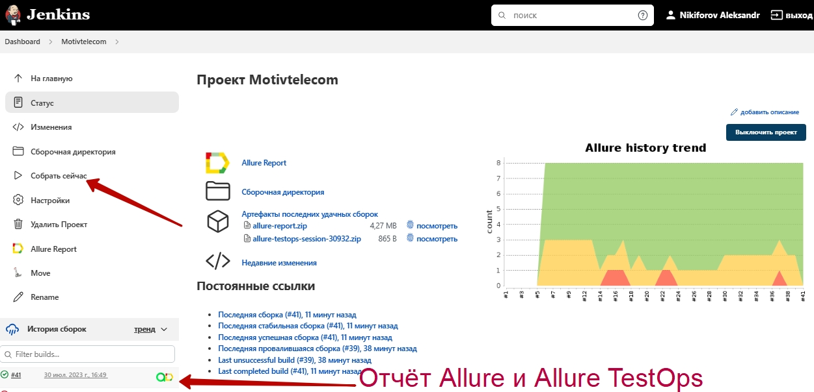
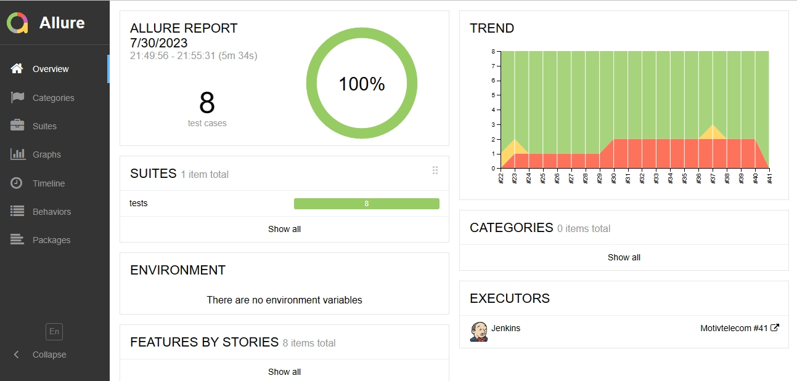
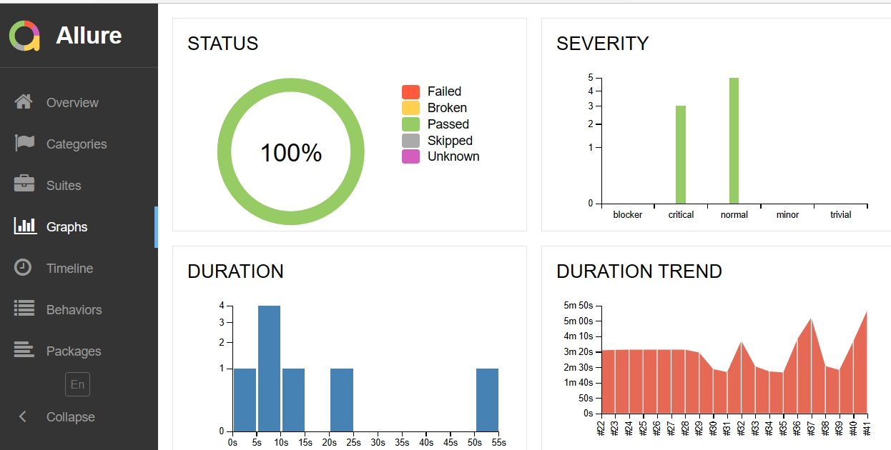
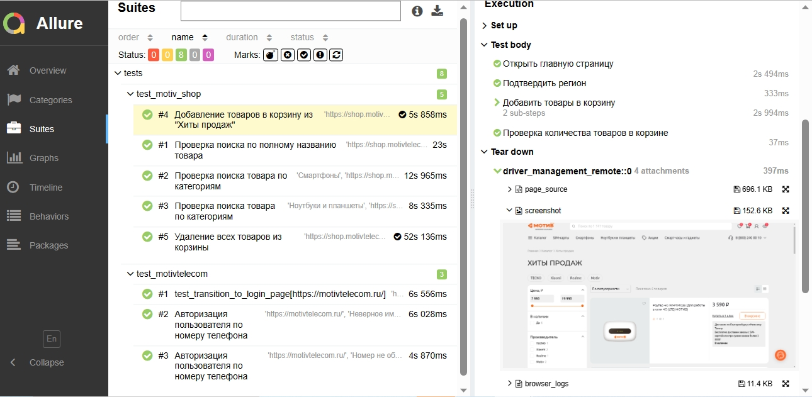
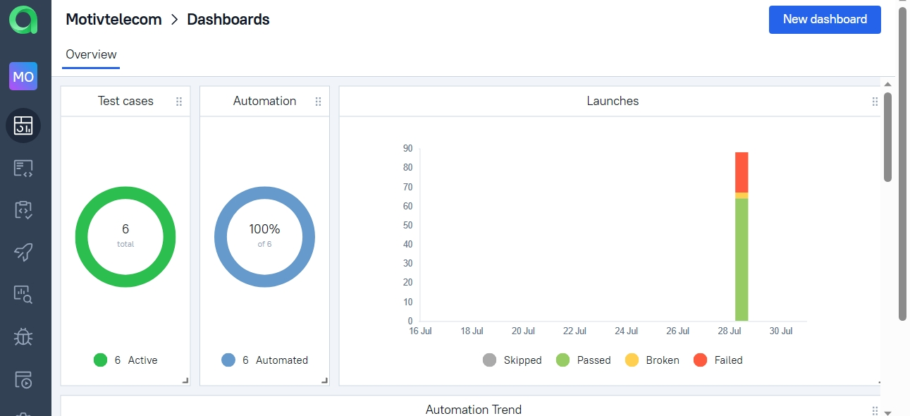
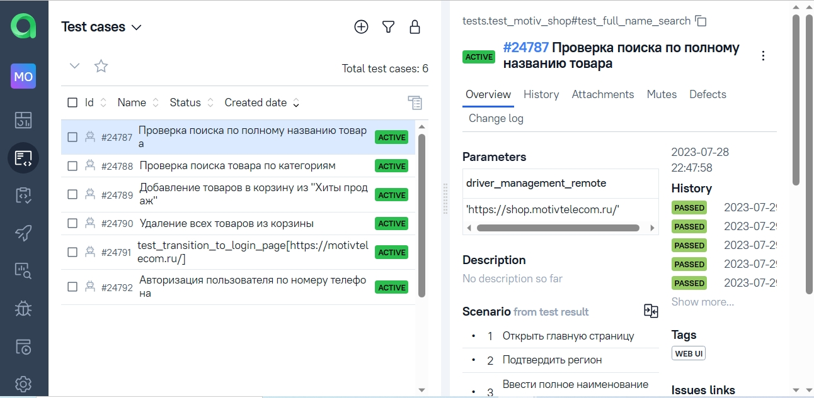
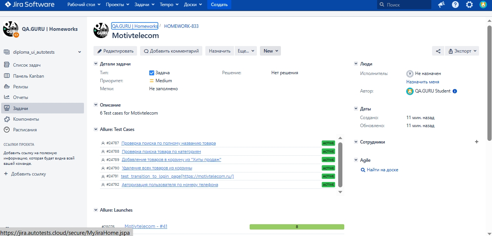
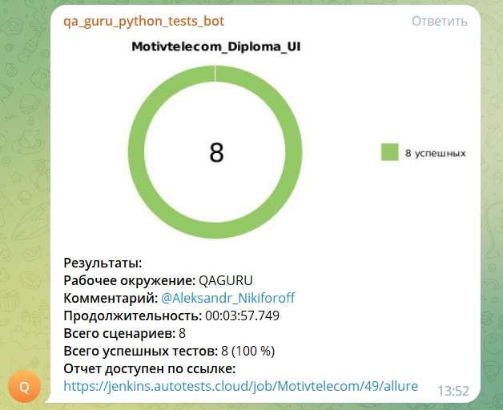

## Проект UI автотестов Motivtelecom.ru

<!-- Технологии -->

  <code></code>
  <code></code>
  <code></code>
  <code></code>
  <code></code>
  <code></code>
  <code></code>
  <code></code>
  <code></code>
  <code></code>
  <code></code>
  <code></code>

<!-- Тест кейсы -->

### Тестируемый функционал
* Проверка авторизации с невалидными данными 
  (параметризованный тест)
* Проверка поиска по полному названию товара
* Поиск товара по категориям (параметризованный тест)
* Добавление товаров в корзину авторизованным пользователем
* Удаление всех товаров из корзины

###  Запуск проекта в Jenkins

### [Запуск проекта в Jenkins](https://jenkins.autotests.cloud/job/Motivtelecom/)

##### Для запуска тестов кликнуть "Собрать сейчас", начнется сборка тестов и их прохождение, через виртуальную машину в Selenoid.

<!-- Allure report -->

###  Allure report
### [Report](https://jenkins.autotests.cloud/job/Motivtelecom/45/allure/)
##### После прохождения тестов, результаты можно посмотреть в Allure отчёте, где так же содержится ссылка на Jenkins

##### Во вкладке Graphs можно посмотреть графики прохождения тестов,отсортированные по приоритезации, по времени прохождения и др.

##### Во вкладке Suites находятся собранные тест-кейсы, у которых описаны шаги и приложены логи, скриншот и видео о прохождении теста

##### Видео прохождения теста

<!-- Allure TestOps -->

###  Интеграция с Allure TestOps

### [Dashboard](https://allure.autotests.cloud/project/3583/dashboards)

##### Так же вся отчетность сохраняется в Allure TestOps, где строятся аналогичные графики и диаграммы.

#### Во вкладке со сьютами, мы можем:
- Управлять всеми тест-кейсами или с каждым отдельно
- Перезапускать каждый тест отдельно от всех тестов
- Настроить интеграцию с Jira
- Добавлять ручные тесты и т.д

<!-- Jira -->

###  Интеграция с Jira
##### Настроив через Allure TestOps интеграцию с Jira, в тикет можно передать результат прохождения тестов и список тест-кейсов из Allure

<!-- Telegram -->

###  Интеграция с Telegram
##### Результат прохождения тестов отправляется в телеграм, со ссылкой на Allure отчет.

